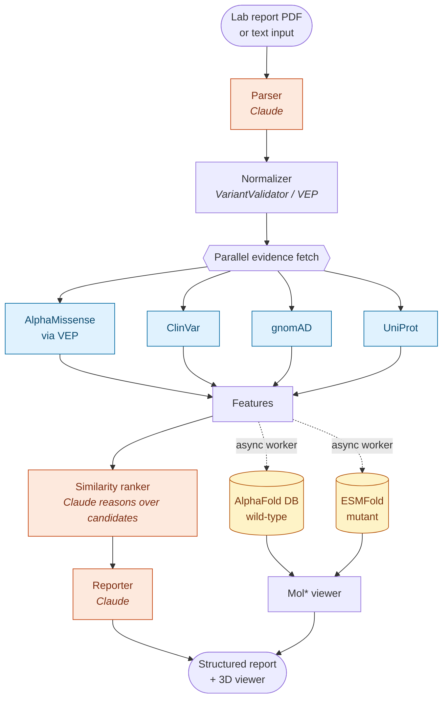
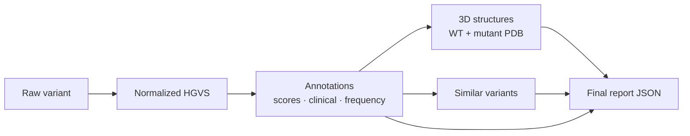

# 🧬 FoldEx

> From "we found a mutation, but we don't know what it means" to a structured, source-cited research report — in minutes instead of weeks.

**Frontend**
&nbsp;


**Backend**
&nbsp;


**LLM**
&nbsp;


**Bioinformatics**
&nbsp;


> ⚠️ **FoldEx is not a diagnostic device.** It is a research-support tool. Every output must be reviewed by a qualified clinician or geneticist. FoldEx does not provide medical advice, diagnosis, or treatment guidance.

🏆 Built for the **Claude Builder Club Social Impact hackathon — Biology & Physical Health track**, inspired by Dario Amodei's *Machines of Loving Grace*.

---

## Table of contents

- [The Problem](#the-problem)
- [What FoldEx does](#what-foldex-does)
- [Architecture](#architecture)
- [Tech Stack](#tech-stack)
- [Repository Layout](#repository-layout)
- [Quick Start](#quick-start)
- [API Reference](#api-reference)
- [How Claude is used (and constrained)](#how-claude-is-used-and-constrained)
- [Ethical Considerations](#ethical-considerations)
- [Limitations](#limitations)
- [Roadmap](#roadmap)
- [Team](#team)
- [License](#license)
- [Acknowledgments](#acknowledgments)

---

## The Problem

When a genetic test returns a **variant of uncertain significance** (VUS — a mutation whose clinical effect is unknown), patients and clinicians are left in limbo. Interpreting a single VUS today means manually stitching together evidence from a dozen siloed databases, structural prediction tools, and sparse literature — work that can take a specialist days or weeks per variant.

FoldEx compresses that workflow. It pulls the same evidence a careful researcher would gather, organizes it into one structured, source-cited report, and lets a human reviewer focus on judgment instead of plumbing.

---

## What FoldEx does

A user submits a single gene variant either as text (e.g. `BRCA1 c.5096G>A p.Arg1699Gln`) or as an uploaded lab-report PDF. FoldEx then:

1. **Parses and normalizes** the variant to HGVS (Human Genome Variation Society) standard form using Claude, validated against bioinformatics tools (VariantValidator, Ensembl VEP).
2. **Annotates** with pathogenicity scores (AlphaMissense, SIFT, PolyPhen via Ensembl VEP), clinical assertions (ClinVar), population frequency by ancestry (gnomAD), and protein metadata (UniProt).
3. **Predicts 3D structures** — wild-type from AlphaFold DB, mutant from ESMFold — and renders them in an interactive Mol\* viewer with the mutated residue highlighted.
4. **Finds the 5–10 most biologically similar known variants**, ranked by gene/domain match, residue distance, amino-acid property change, and pathogenicity-score similarity.
5. **Generates a final structured report** via Claude, separating established clinical evidence from computational prediction, and explicitly flagging weak or conflicting findings.
6. **Adds a patient-friendly summary** beneath the full report — a short, plain-language explanation of what the variant is, what is known versus uncertain, and what the patient should discuss with their clinician. It carries the same non-diagnostic disclaimer and points back to the cited evidence above.

---

## Architecture

The pipeline is **staged** so the frontend can stream partial results as each step completes. Slow steps — especially ESMFold structure prediction — run as async workers so the API stays responsive.



### Data flow between stages



---

## Tech Stack

| Layer | Technology | Role |
|---|---|---|
| Frontend | [Vite](https://vitejs.dev), [React](https://react.dev), [TypeScript](https://www.typescriptlang.org), [TailwindCSS](https://tailwindcss.com) | UI, routing, state, streaming job updates |
| 3D viewer | [Mol\*](https://molstar.org) (with [3Dmol.js](https://3dmol.csb.pitt.edu) as fallback) | Interactive WT vs. mutant rendering |
| Backend | [FastAPI](https://fastapi.tiangolo.com), Python 3.11+ | REST API, pipeline orchestration |
| Job queue | [Redis](https://redis.io) + [RQ](https://python-rq.org) | Async work for slow structure-prediction steps |
| LLM | [Claude API (Anthropic)](https://www.anthropic.com) | Parsing, similarity reasoning, report drafting |
| Structure prediction | [AlphaFold DB API](https://alphafold.ebi.ac.uk), [ESMFold API](https://esmatlas.com) | Wild-type and mutant 3D models |
| Annotation APIs | [Ensembl VEP REST](https://rest.ensembl.org), [ClinVar](https://www.ncbi.nlm.nih.gov/clinvar), [gnomAD GraphQL](https://gnomad.broadinstitute.org/api), [UniProt REST](https://www.uniprot.org) | Functional, clinical, population, and protein evidence |
| Bioinformatics libs | [Biopython](https://biopython.org), [VariantValidator](https://variantvalidator.org) | Sequence handling, HGVS validation |
| Container/deploy | [Docker](https://www.docker.com), docker-compose | Reproducible local + deployed builds |

---

## Repository Layout

```
foldex/
├── frontend/                  # Vite + React app
│   ├── src/
│   │   ├── components/        # ReportView, MolViewer, SimilarityTable
│   │   ├── pages/
│   │   └── lib/api.ts
│   └── package.json
├── backend/
│   ├── app/
│   │   ├── main.py            # FastAPI entrypoint
│   │   ├── routes/
│   │   │   ├── analyze.py     # POST /api/analyze
│   │   │   └── jobs.py        # GET /jobs/{job_id}
│   │   ├── services/
│   │   │   ├── parser.py
│   │   │   ├── normalizer.py
│   │   │   ├── annotator.py
│   │   │   ├── features.py
│   │   │   ├── structures.py
│   │   │   ├── similarity.py
│   │   │   └── reporter.py
│   │   ├── workers/           # RQ workers
│   │   └── schemas/           # Pydantic models
│   ├── prompts/               # Claude system prompts
│   └── pyproject.toml
└── docker-compose.yml
```

---

## Quick Start

### Prerequisites

- Python 3.11+
- Node 20+
- Redis (or use docker-compose, which provides it)
- An Anthropic API key

### Environment

Create a `.env` in the project root:

```env
ANTHROPIC_API_KEY=sk-ant-...
REDIS_URL=redis://localhost:6379
ENSEMBL_VEP_URL=https://rest.ensembl.org
GNOMAD_GRAPHQL_URL=https://gnomad.broadinstitute.org/api
ALPHAFOLD_API_URL=https://alphafold.ebi.ac.uk/api
ESMFOLD_API_URL=https://api.esmatlas.com/foldSequence/v1/pdb
```

### Run with Docker (recommended)

```bash
docker-compose up --build
# Frontend → http://localhost:5173
# Backend  → http://localhost:8000
```

<details>
<summary>Local development (without Docker)</summary>

```bash
# Backend
cd backend
pip install -e .
uvicorn app.main:app --reload --port 8000

# Worker (in a separate shell)
rq worker foldex

# Frontend (in a third shell)
cd frontend
npm install
npm run dev
```

</details>

### Try it

```bash
curl -X POST http://localhost:8000/api/analyze \
  -H "Content-Type: application/json" \
  -d '{"text": "BRCA1 c.5096G>A p.Arg1699Gln"}'
```

The response returns a `job_id`. Poll `/jobs/{job_id}` to watch the pipeline complete in stages.

---

## API Reference

| Method | Path | Description |
|---|---|---|
| `POST` | `/api/analyze` | Accepts text or PDF, returns `job_id` |
| `GET` | `/jobs/{job_id}` | Returns job status and partial/final report |
| `GET` | `/structures/{job_id}/{kind}` | Returns PDB file (`wt`, `mutant`, or `variant_<id>`) |

### Examples

**Submit text input:**

```bash
curl -X POST http://localhost:8000/api/analyze \
  -H "Content-Type: application/json" \
  -d '{"text": "BRCA1 c.5096G>A p.Arg1699Gln"}'
# → { "job_id": "8b4c…" }
```

**Submit a PDF lab report:**

```bash
curl -X POST http://localhost:8000/api/analyze \
  -F "file=@lab_report.pdf"
```

**Poll job status:**

```bash
curl http://localhost:8000/jobs/8b4c...
```

**Fetch a predicted structure:**

```bash
curl http://localhost:8000/structures/8b4c.../mutant -o mutant.pdb
```

---

## How Claude is used (and constrained)

Claude appears at three points in the pipeline. In each, it acts as a **reasoner over evidence retrieved from authoritative sources** — never as a generator of variant data or citations.

| Stage | What Claude does | Guardrail |
|---|---|---|
| **Parsing** | Reads free-text or extracted PDF content and proposes an HGVS-normalized variant | Output is rejected unless VariantValidator / Ensembl VEP confirms it resolves to a real transcript and position |
| **Similarity ranking** | Reasons over a pre-filtered candidate list to explain why each near-neighbor variant is biologically relevant | Candidate set is computed deterministically from gene, domain, residue distance, and property change; Claude only ranks and explains within that set |
| **Report writing** | Drafts the final structured report from the assembled evidence dossier | Prompt enforces strict separation of *established clinical evidence* vs. *computational prediction*; every claim must cite a source already present in the dossier |
| **Patient summary** | Rewrites the finished report into a short plain-language explanation for the patient | Generated only from the already-grounded report — no new facts, no new sources; jargon is translated, uncertainty is preserved, and the non-diagnostic disclaimer is reiterated |

### Constraints encoded in prompts and code

- **No invented variants.** Parsing output that fails normalization is discarded; Claude is not asked to "fix" it.
- **No fabricated citations.** The reporter prompt only permits citing sources present in the evidence dossier passed to it.
- **No clinical conclusions.** The reporter is instructed to summarize evidence and surface uncertainty, not to recommend action.
- **Conflicts are flagged, not resolved.** If ClinVar submitters disagree, or a high AlphaMissense score conflicts with a benign ClinVar entry, the report calls that out explicitly.

---

## Ethical Considerations

- **Not diagnostic.** FoldEx is a research-support tool. Disclaimers appear in the UI, in the report header, and in the JSON output — not buried in fine print.
- **Human in the loop.** Every report is intended for review by a qualified clinician or geneticist before any action is taken.
- **No invention.** Architectural and prompt-level guardrails prevent Claude from producing variants or citations that aren't grounded in upstream data sources.
- **Equity of access.** The longer-term goal is a cross-subsidy model so that variants from underrepresented populations — where ClinVar and gnomAD coverage is weakest — are not deprioritized.
- **Privacy.** No PHI (Protected Health Information) is required to use FoldEx. Uploaded PDFs are processed in memory and not persisted to disk.

---

## Limitations

- **AlphaFold DB only stores wild-type structures.** Mutant predictions come from ESMFold, which has its own confidence and accuracy bounds.
- **gnomAD ancestry coverage is uneven.** Population-frequency estimates are weaker for under-represented groups, and FoldEx surfaces this rather than smoothing it over.
- **ClinVar coverage varies by gene.** Well-studied genes like BRCA1/2 have rich submitter consensus; many others do not.
- **Similarity is biological, not clinical equivalence.** A nearby variant with a known classification is a *clue*, not a verdict.
- **Single-variant scope.** FoldEx analyzes one variant per submission. Multi-variant interactions and structural variants are out of scope for this release.
- **English-language inputs only** for the current parser.

---

## Roadmap

- OCR ingestion for scanned lab reports
- LitVar / PubMed integration for literature-grounded evidence
- MaveDB integration for experimental functional-assay data
- Batch mode for cohort or panel analysis
- Researcher export packets (PDF + machine-readable JSON + structure files)

---

## Team

[TODO: add team members]

---

## License

[MIT](LICENSE)

---

## Acknowledgments

FoldEx stands on the shoulders of the open scientific community. Thanks to:

- **Anthropic** — Claude API and the Builder Club hackathon
- **Ensembl** — VEP REST and variant annotation infrastructure
- **NIH / NCBI ClinVar** — clinical variant assertions
- **Broad Institute gnomAD** — population frequency data
- **EBI AlphaFold** — predicted wild-type protein structures
- **Meta AI ESMFold** — mutant structure prediction
- **UniProt** — protein function and domain annotation

And to every submitter, curator, and maintainer who keeps these public resources alive.
